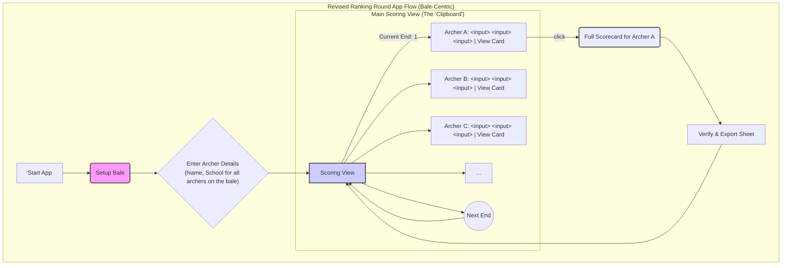

# Feature Brief: Redesigned Ranking Round Workflow

**Document Owner:** Pam (Product Manager)
**Status:** Proposed
**Date:** 2025-06-11

---

### 1. The Challenge: Aligning with Real-World Scoring

Following a review of the initial `score360` prototype, it became clear that its tab-based navigation did not align with the actual workflow used by scorers during a competitive Ranking Round.

The real-world process, as observed on the field, is "bale-centric," not "archer-centric." A designated scorer is responsible for recording scores for a group of archers (typically 2 to 4) on a single target bale. The process is as follows:

1.  All archers on the bale shoot one "end" (e.g., 3 arrows).
2.  The group approaches the target to score.
3.  The scorer records the scores for that single end for **every archer** on the bale, one after the other.
4.  This process is repeated for all subsequent ends.

The previous design forced the scorer to switch between full-screen tabs for each archer, which is inefficient and does not mirror this natural, end-by-end group scoring method.

### 2. The Solution: A "Digital Clipboard"

To address this, we are redesigning the Ranking Round application to function as a "Digital Clipboard." The new workflow will be intuitive for any experienced scorer, as it directly mimics the process of filling out a paper scoresheet for a whole bale.

The core idea is to move from a multi-screen, tabbed interface to a single, scrollable scoring view that presents the current end's score entry for all archers at once.

### 3. Visualizing the New Workflow

This diagram illustrates the proposed user journey, from setting up the bale to exporting the final scorecard.

### 4. Step-by-Step Feature Breakdown

1.  **Bale Setup (Setup Bale):**
    *   The user starts by creating a scoring session for a specific bale.
    *   They will add each archer shooting on that bale (e.g., Archer A, B, C, D) and enter their basic information (Name, School). This is a flexible list, not a fixed number of slots.

2.  **The Scoring View (The Digital Clipboard):**
    *   This is the primary screen for the scorer.
    *   It displays a list of all archers on the bale.
    *   Crucially, it only shows the score input fields for the **current end**.
    *   The scorer can quickly enter the three arrow scores for Archer A, move to Archer B, and so on, all on one screen.
    *   After scoring the end for all archers, they tap a "Next End" button, which clears the input fields and advances the round, ready for the next set of scores.

3.  **Viewing the Full Scorecard (View Card):**
    *   While the main view is for rapid data entry, a scorer or archer may need to see the full, traditional scorecard at any time.
    *   A "View Card" button next to each archer's name will navigate to a detailed view showing that individual's complete scoresheet with all ends, end totals, and running totals.

4.  **Verification and Export (Verify & Export Sheet):**
    *   The individual scorecard view is where the final results are verified.
    *   From this screen, the user will have access to the "Save as Image" and "Copy as Text" functions, allowing them to save a complete, verifiable record of the round, just as they would with a physical card.

### 5. Next Steps

This user-centric design will now serve as the blueprint for the development team's refactoring efforts. The next phase will involve creating a unified CSS framework and then building this new interface, ensuring it is both functionally accurate and mobile-friendly. 